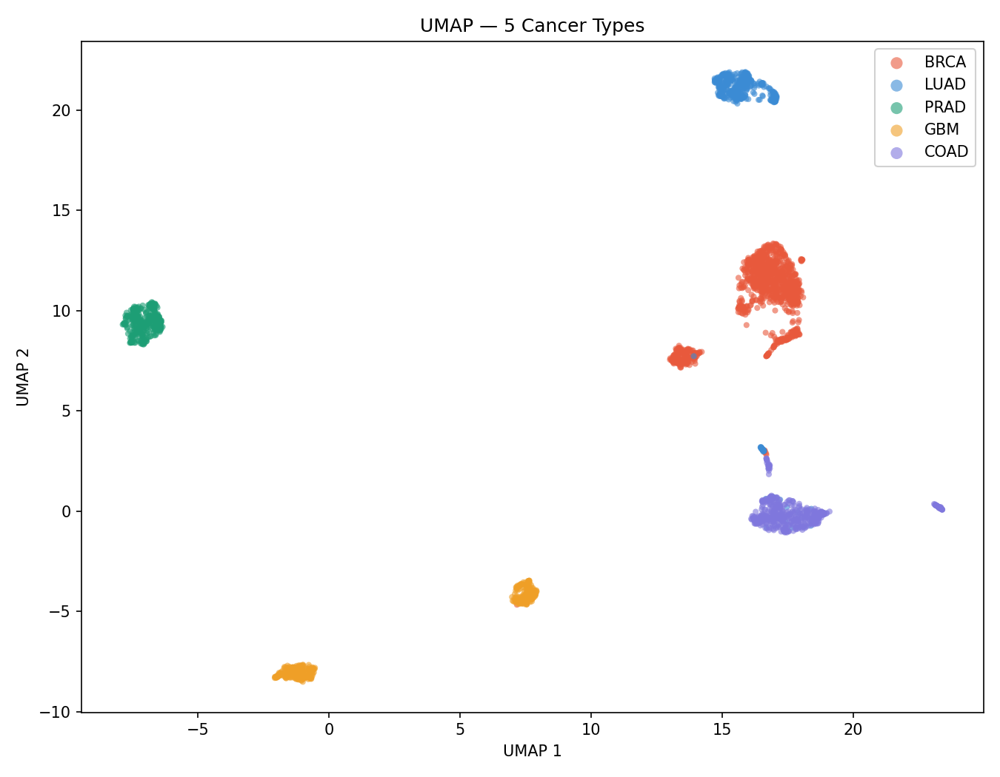
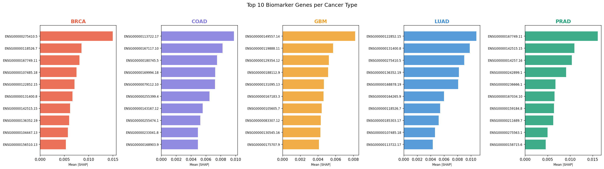
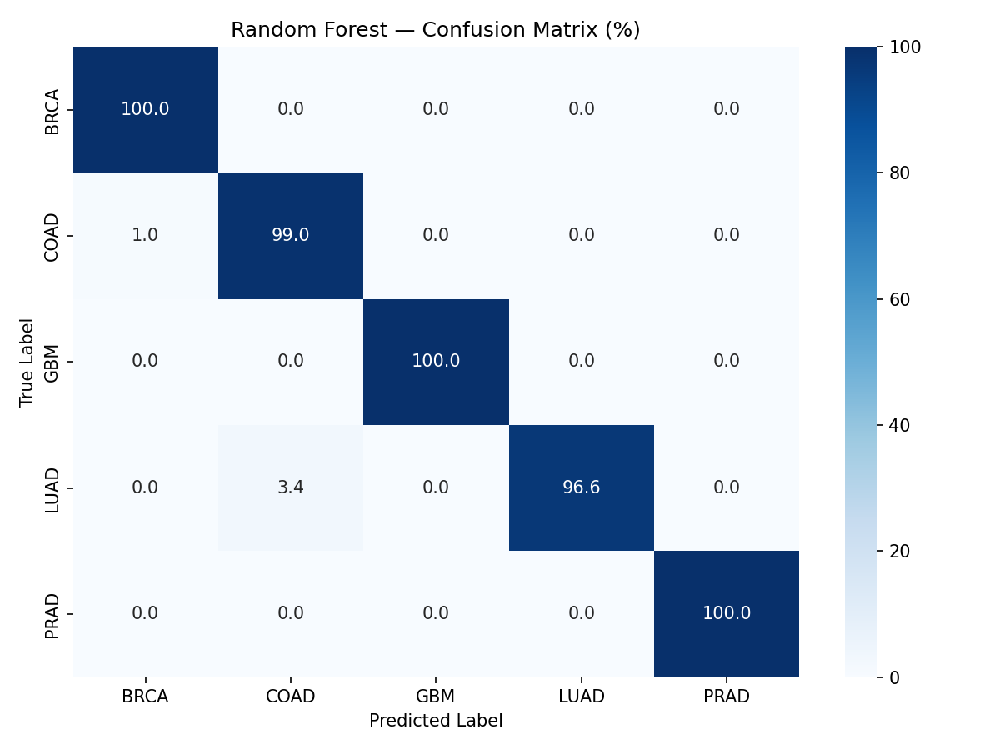

# 🧬 Cancer Gene Expression Classifier

AI-powered cancer type prediction from RNA-seq gene expression data, trained on real patient samples from The Cancer Genome Atlas (TCGA).

## 🎯 Results
| Model | Accuracy |
|---|---|
| Random Forest | 99.3% |
| XGBoost | 98.9% |
| PyTorch CNN | 99.1% |

## 🔬 What It Does
Takes a patient's RNA-seq gene expression profile (5,000 genes) and predicts which of 5 cancer types the tumor belongs to:
- 🎀 **BRCA** — Breast Invasive Carcinoma (1,135 samples)
- 🫁 **LUAD** — Lung Adenocarcinoma (439 samples)
- 🔵 **PRAD** — Prostate Adenocarcinoma (356 samples)
- 🧠 **GBM** — Glioblastoma Multiforme (384 samples)
- 🟣 **COAD** — Colon Adenocarcinoma (497 samples)

## 🧪 Key Discovery — SHAP Biomarker Analysis
SHAP explainability independently rediscovered clinically validated cancer biomarkers:

| Cancer | Top Gene | Clinical Significance |
|---|---|---|
| BRCA | GATA3 | Standard breast cancer pathology marker |
| LUAD | NKX2-1 | Lung adenocarcinoma master regulator |
| PRAD | KLK3 (PSA) | Standard prostate cancer blood test since 1979 |
| GBM | FEZ1 | Brain-specific neuronal development gene |
| COAD | CDX1 | Intestinal master regulator |

## 📊 Visualizations
| Plot | Description |
|---|---|
|  | UMAP showing 5 perfectly separated cancer clusters |
|  | Top biomarker genes per cancer type |
|  | Random Forest confusion matrix |

## 🚀 Live Demo
👉 **[Try the app on HuggingFace](https://huggingface.co/spaces/Hanumanthakp/cancer-gene-classifier)**

## 🛠️ Tech Stack
- **Data:** TCGA via GDC Portal (RNA-seq STAR counts)
- **ML:** scikit-learn, XGBoost
- **Deep Learning:** PyTorch (1D CNN)
- **Explainability:** SHAP
- **Visualization:** matplotlib, seaborn, UMAP
- **Deployment:** Streamlit + HuggingFace Spaces

## 📁 Project Structure
## ⚡ How to Reproduce
```bash
# Install dependencies
pip install -r requirements.txt

# Download TCGA data from GDC portal
# Filter: TCGA-BRCA, TCGA-LUAD, TCGA-PRAD, TCGA-GBM, TCGA-COAD
# RNA-Seq, Transcriptome Profiling, STAR Counts

# Run pipeline
python build2_matrix.py    # Build expression matrix
python eda.py              # Generate EDA plots
python train_model.py      # Train models
python shap_analysis.py    # SHAP analysis
python cnn_model.py        # PyTorch CNN
streamlit run app.py       # Launch app
```

## 📈 Dataset
- **Source:** The Cancer Genome Atlas (TCGA) via GDC Portal
- **Samples:** 2,811 real patient tumor biopsies
- **Features:** 5,000 most variable genes (filtered from ~60,000)
- **Normalization:** log1p on raw RNA-seq counts

## 🏥 Clinical Relevance
This project demonstrates that AI can independently rediscover biomarkers that took decades of wet lab research to validate. The SHAP analysis found PSA (KLK3) — the most widely used prostate cancer blood test — purely from expression patterns with no biological knowledge provided.

## 👤 Author
Hanumantha K P  
[HuggingFace](https://huggingface.co/Hanumanthakp) · [LinkedIn](https://linkedin.com/in/hanumantha-kp-5482a4367)
